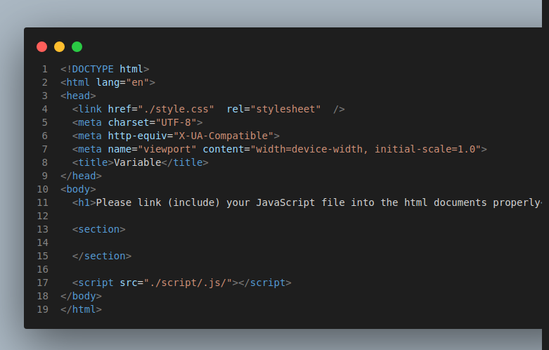

# Variable-Assignment
Follow the instruction below to demonstrate your understanding of variable.
## Usage
`You are adviced to follow the instruction carefully. Read and do what each instruction says before moving to the next instruction.`
### Cloning the repository
  - clone this repository to your local computer (machine)
    - copy the repo's remote https url by clicking the green button named, `code` above 
    - goto your local computer desktop,
    - right click anywhere but not on a file or folder, a context menu will appear,
    - on the context menu, click on `Git Bash here`, the git bash window will open
    - type the following command into the git bash window and paste the url into the terminal as follows:
    
      ```
      git clone <repo's remote url>
      ```
    - example command, the command and the url should look like this:
      ```
      // note that this is not the correct url, but it's a good example
      git clone https://github.com/ezehlivinus/codevile.git
      ```
    - press `enter` key to execute the command and to start cloning the repo
    - it should look like this: 
    - 
    - the repo will be cloned to your local machine, the repo will be stored in the folder named `variable-assignment`
    - close the git bash window/terminal
### Removing the repo from your local machine
  - From your desktop open the folder named `variable-assignment`
    - right click inside the folder, but not on a file or folder, a context menu will appear,
    - on the context menu, click on `Git Bash here`, the git bash window will open
    - type the following command and press `enter` to remove the repo and its owner from the local machine:
    
      ```
      rm -rf .git
      ```
    - if the command above works fine you will not see any errors or message, if not, you will see an error message,
### Open the project with your vscode (visual studio code)
You can open the project in several ways, open using either the first method or the second method
  - First method:
    - from your desktop, open the folder named `variable-assignment`
    - right click inside the folder, but not on a file or folder, a context menu will appear,
    - on the context menu, click on `Open with vscode`, or `Open with visual studio code`, the vscode window will open
  - Second method:
    - from your desktop, open the folder named `variable-assignment`
    - right click inside the folder, but not on a file or folder, a context menu will appear,
    - on the context menu, click on `Git Bash here`, the git bash window will open
    - type the following command and press `enter` to open the project in vscode:
    
      ```
      code .
      ```
    - if the command above works fine you will not see any errors or message, if not, you will see an error message
  - In either case, the vscode window will open and should look like this:
    
    - `congratulation you have successfully opened the project in vscode and ready to start coding`

## Assignment Instructions
With your project (`variable-assignment`) open in vscode
### Files
  - You will see three files and a folder
    - `images/`
    - `README.md`
    - `index.html`
    - `script.js`
  - Open each of the file to see the contents, do not type or change anything in the files yet

### Running the html file
  - Run your `index.html` file the usual way, of course by opening it in your browser
  - Oops, there is an error, you need to link your `script.js` file into the html document properly
### Fixing the error
  - Go to your vscode and open the file named `index.html`
    - It should look like this: 
    - Look at line 17, the line should look like this:
      ```
      <script src="./script/.js/"></script>
      ```
    - From your knowledge of html and javascript, you noticed the bug in the line, and you decide to fix it by linking the script properly
    - Yes the bug was caused by the wrong path (`./script/.js/`), the correct path is `./script.js`
    - replace or change line 17 with the following line:
      ```
      <script src="./script.js"></script>
      ```
    - save the file
    - goto to your browser, and refresh, the result should look like this:
      
    - congratulations, you have successfully fixed the error(bug) in the html file
### Writing the code
  - Open the file named `script.js`
    - It should look like this: 
  - You still remember how to create a variable? you are correct, you can create a variable in javascript by using the following syntax:
    ```
    let variableName = value;
    // example
    let myCountryName = 'Nigeria';
    ```
  - Yes, always remember to use the `let` keyword to create a variable, otherwise you will get an error message.
  - Use your javascript knowledge to create the following variables.
    - Create a variable named `firstName` and assign it the value of your first name
    - Create a variable named `lastName` and assign it the value of your last name
    - Create a variable named `fullName` and assign it a value of your the variables `firstName` and `lastName` combined/concatenated together. 
      - Example: If your `firstName` is `Ezeh` and `lastName` is `Livinus`, the value of `fullName` should be `Ezeh Livinus`. 
      - Another example:
      ```
      let first = 'English';
      let second = 'Language';
      let fullSubjectName = first + ' ' + second; // the result will be: fullSubjectName = English Language
      ```
    - Create a variable named `introduction` and assign it a value the 'Hello, my name is ' concatenate (join) it with the `fullName` variable so the result should look like this:
      ```
      Hello, my name is Ezeh Livinus.
      ```
    - Create a variable named `myEyesColor` and assign it a value of your eyes color
    - Create a variable named `myHairColor` and assign it a value of your hair color
    - Create a variable named `myNumberOfSiblings` and assign it a value of the number of siblings you have
    - Create a variable named `myFavouriteFood` and assign it a value of your favorite food
    - Create a variable named `myFavouriteColor` and assign it a value of your favorite color
  - The result should look like this:
    - 
    - Congratulations, you have successfully written the code in the script.js file

  - GIT and GITHUB ACTIVITIES
    - Create a repository within from your vscode project by clicking on the `source control` button/icon in the vscode toolbar. The icon/button looks like this
    - 
    - click on `Publish to GitHub` button, 
    - type a nice name for your repo. The name should represent why you are creating/publishing the repo, for me have chosen `variable-assignment-solution`. You can use the same. The process should look like this:
      
    - You might be ask to sign in to github do it and continue
    - Go to your github account to verify if the repo created and it content pushed 
    - If not, From your vscode, Try pushing your code to github, by clicking on the `source control` button/icon in the vscode toolbar. The icon/button looks like this
      
    - click on ... and click on push, your work should be pushed to github
    - Congratulations, you have successfully created a repo and pushed your code to github
  - STYLING THE HTML CODE
    - from your vscode,
    - Using your knowledge of css, create a css file that will style the html code, named the `style.css`
    - check if the css file was linked properly in the html file
    - The following ids (identities) has been created for you when you were working on the html file:
      - `introduction`
      - `my-hair-color`
      - `my-number-of-siblings`
      - `my-favourite-food`
      - `my-favourite-color`
    - As an expert css developer, style each of the ids above
      - Example: I have chosen to style the `introduction` and `my-favourite-color`id with the following css:
        ```
        #introduction {
          color: aquamarine;
          background-color: blueviolet;
          font-size: 1.2em;
          font-weight: bold;
          margin-bottom: 1em;
          padding: 0.5em;
        }

        #my-favourite-color {
          color: white;
          background-color: rgb(2, 12, 8);
          font-size: 1.2em;
          font-weight: bold;
          margin-bottom: 1em;
          padding: 0.5em;
        }
        ```
      - When I saved the css file, my result looked like this:
      - 
      - Bonus points: style the parent element of the ids above.
        - The parent element is the section tag
        - I styled mine with background color of `yellowgreen` and padding value of `10px` and this is the result I got:
        
    - Congratulations, you have successfully styled the html code
    - GIT and GITHUB
      - From your vscode,
      - Click on the `source control` button/icon in the vscode toolbar. The icon/button looks like this
      - 
      - stage all the changes
      - commit the changes, do not forget to add a message of the changes you make
      - push the changes to github
      - verify if the changes were pushed to github
      - Congratulations, you have successfully staged, committed, and pushed your changes.
## Submitting the assignment
  - Method1 - by sending email
    - send me the link of the repo's url to my email address.
    - if you have chosen the repo name to be `variable-assignment-solution`, the url should be `https://github.com/youu-github-username/variable-assignment-solution`
  - Method2 - adding a contributor(collaborator)

    - Add me as your contributor, to do this, do the following
    - Go to your, example `https://github.com/your-github-username/variable-assignment-solution` and click on the `settings` button.
    - click on `collaborators`
    - confirm your password
    - click on `Add people`
    - type my email address or my username which is `ezehlivinus` 
    - click on `add ezehlivinus to this repo` button
  - Congratulations, you have successfully submitted the assignment
